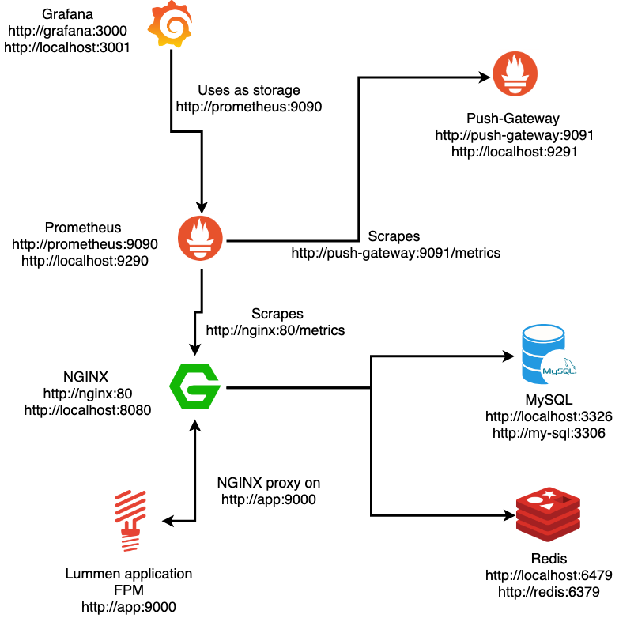
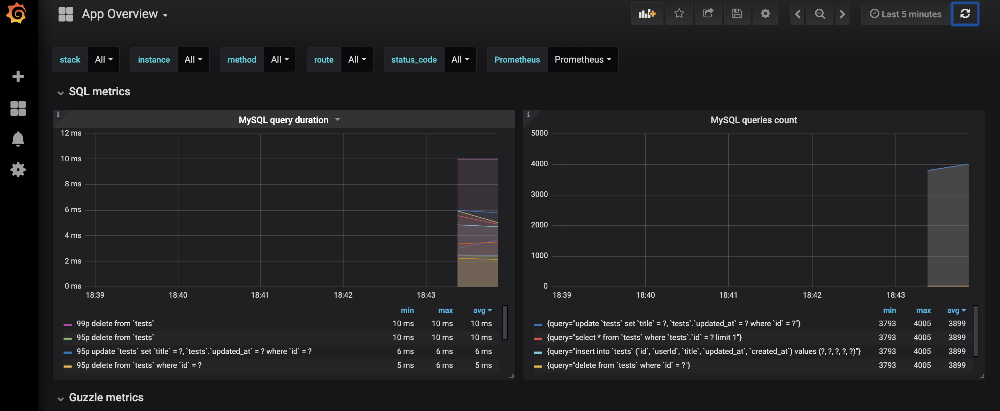

# Test Application 
This application was created in order to be able to test various aspects 
and functionality of the prometheus exporter project. It may also act as 
a dockerized test-bed installation of Lumen.



## Installation
In order to run this application you'll need [Docker](https://docs.docker.com/install/) 
along with [docker-compose](https://docs.docker.com/compose/install/).
For some functions you will also need cURL.

## Usage
The most commands needed exist in the `Makefile`. This includes
common commands for Docker, as well as commands for extra functionality,
like printing url of the available services to stdout.

### Basic usage

- To run this project and test the results you simply need to run `$ make up`,

- head to `localhost:8080/test` (default port) make a few requests or use:

```bash
$ make call
```

`call` will perform a number of requests via curl. Default is 100 requests.
If you wish to change the number head to `.env.docker` and set `TIMES_TO_CALL_EXAMPLE_ROUTE`
to your preference.

- The last step is to open Grafana and see your metrics!
Grafana listens to `localhost:3326` (default port).

### Useful commands

- To print all the available commands
```bash
$ make help
```

- To create and start the application services run:
```bash
$ make up
```

- To start the application services run:
```bash
$ make start
```

- To stop the application services run:
```bash
$ make stop
```

- To completely remove the application services run:
```bash
$ make down
```

### Change application ports

The ports registered in the example application might be already 
taken. If you happen to have conflicts you need to change the port having
conflicts in `.env.docker`.

E.g.
The Grafana port is registered at `3326` 

```dotenv
EXAMPLE_APP_GRAFANA_PORT=3326
```

You'll need to change it as:

```dotenv
EXAMPLE_APP_GRAFANA_PORT=3111
```

### Rebuild the example app container

To remove the built image and create it again:
```bash
$ make rebuild
```

### Calling the route

The example route for testing is at `localhost:8080/test`

Each time you perform `make up` all the services get printed.
To print all the available services use:

```bash
$ make generate-links
``` 

### Updating Grafana

Each time you perform `make up` the `dashboard.json` Grafana dashboards along with 
the available data-sources, get updated.
To perform the update by yourself use:

```bash
$ make provision
``` 

The default Grafana credentials are:
```
username: admin
password: admin
```

To check the diagrams containing metrics, head to your 
given Grafana URL and click on `Home -> App Overview`.

Prometheus scrapes every 30 seconds so be patient and 
make enough calls to see your metrics.

 An example view if you have completed the process successfully 
 should be: 
  

 